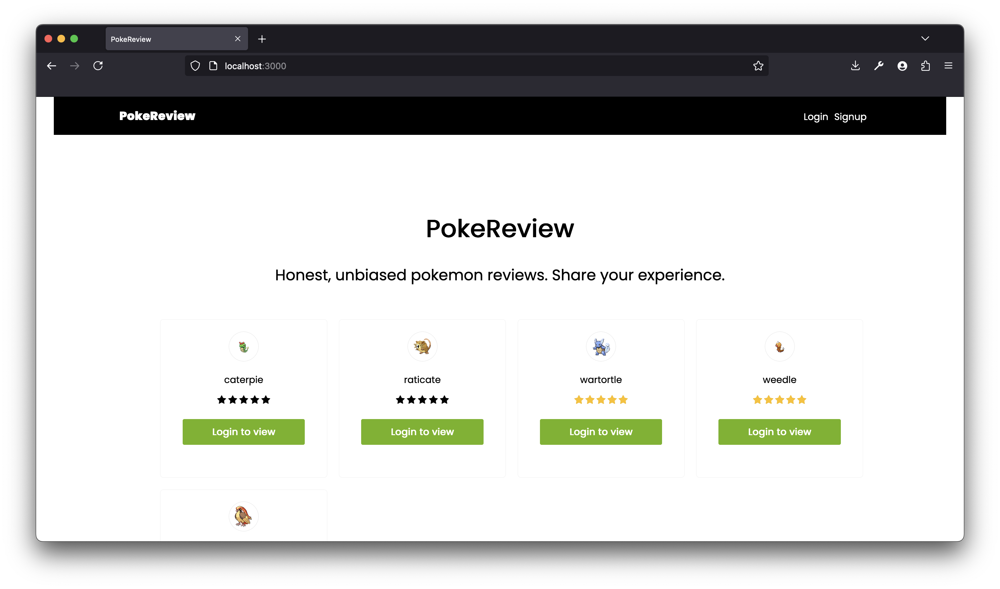
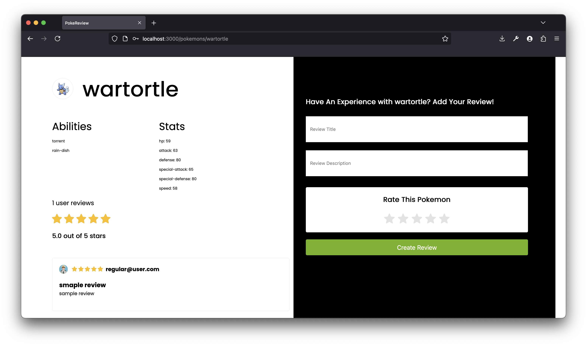
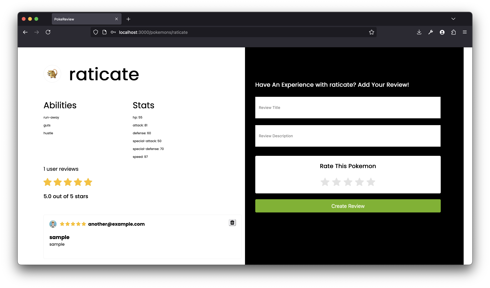
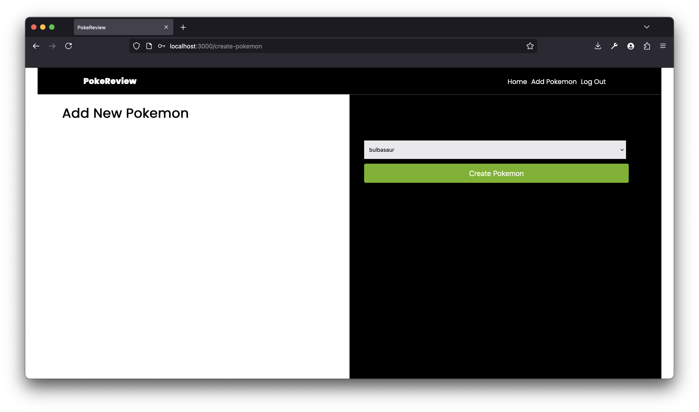
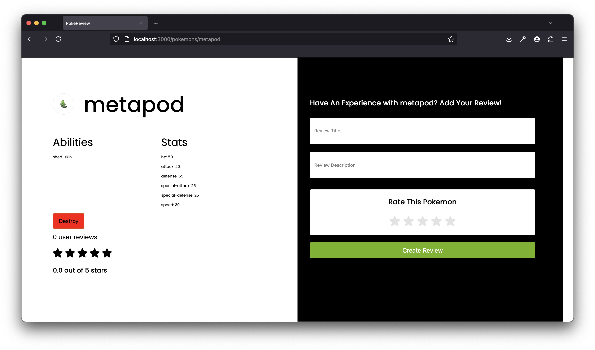
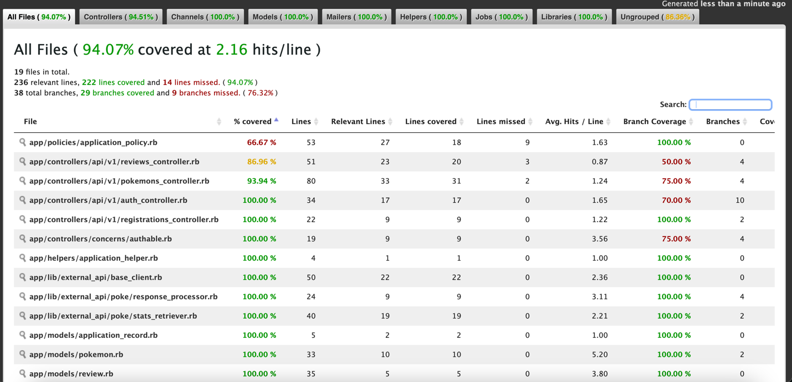

## PokeReview
### A pokemon reviews CRUD app built with Ruby on Rails and React.js

This app is intended to be a simple example of a CRUD app built with **Ruby on Rails** and **React.js** using **Webpacker**.

### Regular user behaviour




### Admin user behaviour



---
## Prerequisites: ENV setup
Create `.env` and copy the needed variables from `.env.example`

```shell
touch .env && cp .env.example .env
```

## Running it locally with Docker

To setup the app locally with docker-compose:

1. Install Docker
2. Run build
   ```bash
   docker-compose build
   ```
4. Bundle install & rails database setup:

   ```bash
   docker-compose run --rm rails rails db:prepare
   docker-compose run --rm rails rails db:seed
   ```

5. Run Rails:

   ```bash
   docker-compose up
   ```

## Other commands

To run Rails:

```bash
docker-compose up
```

To run specs

```bash
docker-compose run --rm rails rspec
```

To stop the running application(s): `Ctrl-C`

To stop all services:

```bash
docker-compose down
```

Access your local server at <http://localhost:3000>

**NOTE: THIS WILL DELETE ALL LOCAL CONTAINERS, IMAGES, CONTAINERS, VOLUMES, etc.**
To clean up Docker (for rebuilding your local environment):

```bash
docker system prune -a && docker volume prune
```

## Routes
```shell
                                    root GET    /                                                                                                 pages#index
                         api_v1_pokemons GET    /api/v1/pokemons(.:format)                                                                        api/v1/pokemons#index
                                         POST   /api/v1/pokemons(.:format)                                                                        api/v1/pokemons#create
                      new_api_v1_pokemon GET    /api/v1/pokemons/new(.:format)                                                                    api/v1/pokemons#new
                     edit_api_v1_pokemon GET    /api/v1/pokemons/:slug/edit(.:format)                                                             api/v1/pokemons#edit
                          api_v1_pokemon GET    /api/v1/pokemons/:slug(.:format)                                                                  api/v1/pokemons#show
                                         PATCH  /api/v1/pokemons/:slug(.:format)                                                                  api/v1/pokemons#update
                                         PUT    /api/v1/pokemons/:slug(.:format)                                                                  api/v1/pokemons#update
                                         DELETE /api/v1/pokemons/:slug(.:format)                                                                  api/v1/pokemons#destroy
                          api_v1_reviews POST   /api/v1/reviews(.:format)                                                                         api/v1/reviews#create
                           api_v1_review DELETE /api/v1/reviews/:id(.:format)                                                                     api/v1/reviews#destroy
                    me_api_v1_auth_index GET    /api/v1/auth/me(.:format)                                                                         api/v1/auth#logged_in
                logout_api_v1_auth_index DELETE /api/v1/auth/logout(.:format)                                                                     api/v1/auth#logout
                       api_v1_auth_index POST   /api/v1/auth(.:format)                                                                            api/v1/auth#create
                    api_v1_registrations POST   /api/v1/registrations(.:format)                                                                   api/v1/registrations#create
```

### Seeds
By default app generates seeds with 4 sample Pokemons and 2 users: regular and admin user

#### Creds for login
- Admin user `email: admin@example.com, password: password`
- Regular user `email: another@example.com, password: password`

## Features

### Authentication
Users can create accounts with a default role of "regular user" and leave reviews for any Pokémon. An admin role can be created by running rails db:seed or directly from the console.

### Authorization
By default, unauthorized users can only navigate to the root path and view the list of Pokémon. Once logged in, a regular user can create reviews on a Pokémon's page. Admin users cannot leave reviews.
Instead, admin users have the ability to create and delete Pokémon entities. All authorization rules are managed by Pundit policies.

### Permissions

| Action/Role    |   Admin  | Regular  |
|----------------|----------|----------|
| Login          | YES      | YES      |
| Signup         | NO       | YES      |
| View Pokemon   | YES      | YES      |
| Add Pokemon    | YES      | NO       |
| Delete Pokemon | YES      | NO       |
| Add Review     | NO       | YES      |
| Delete Review  | NO       | YES      |

### Integrations
There is an integration with PokeAPI that admin users can utilize to create Pokémon. The user only needs to select the Pokémon's name and submit the form.
Once backend receives the pokemons POST it triggers `Pokemons::Create` service which implements SimmpleCommand pattern. It makes additional HTTP request to PokeAPI to get additional stats data for certain pokemon record.

`ExternalApi::BaseClient` implements simple HTTParty wrapper which we can use for collection stats data via `ExternalApi::Poke::StatsRetriever` and handles response by `ResponseProcessor`.

### Coverage



## TODO
- Add Graphql as V2
- FE components raw refactor
- Implement MaterialUI instead of styled-components
- Add Github Actions